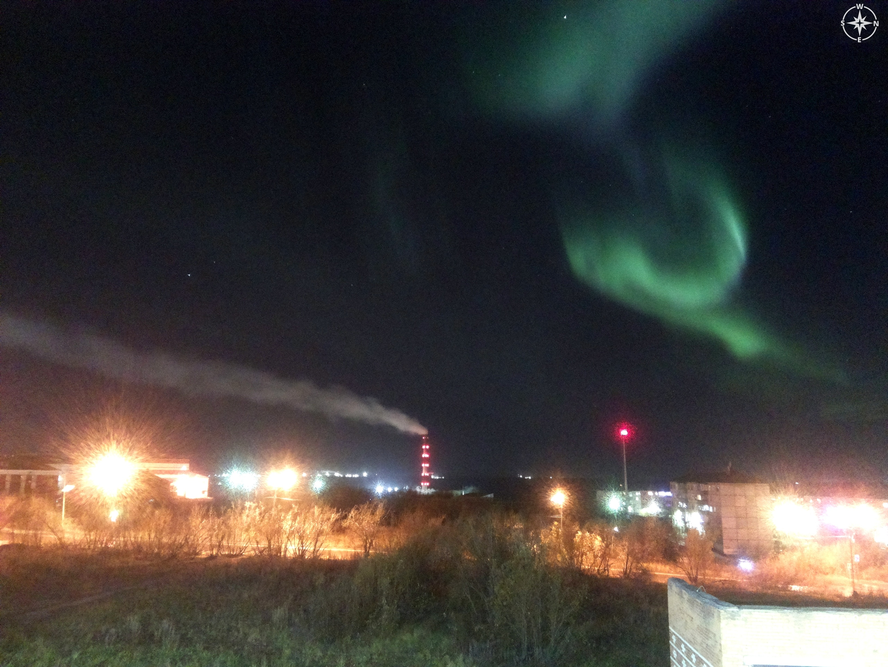
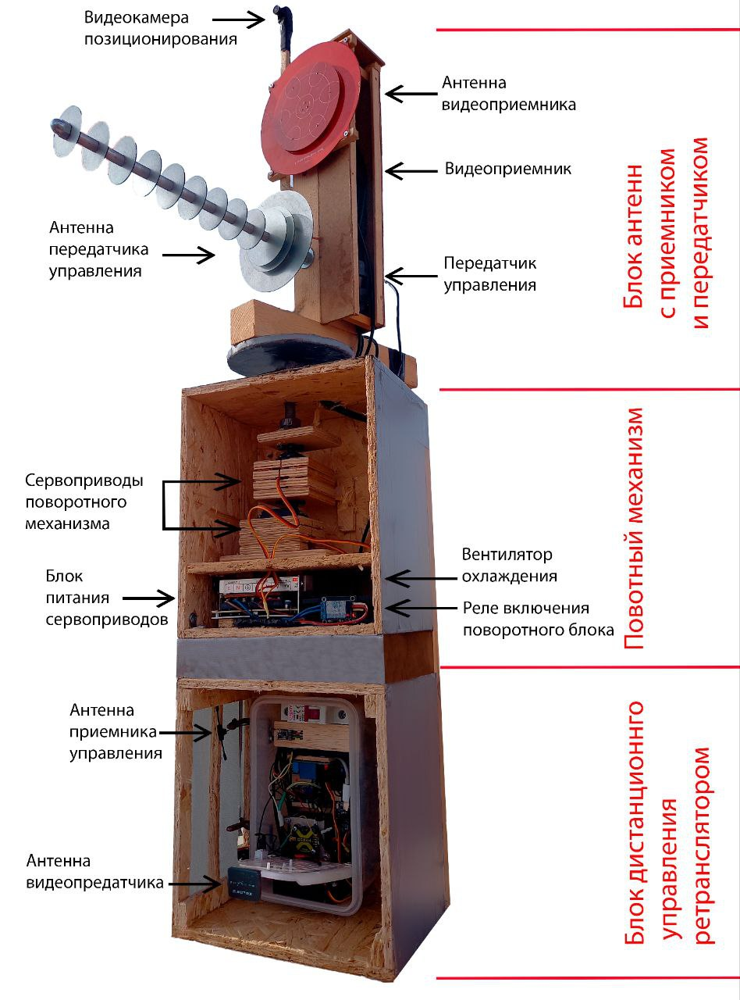
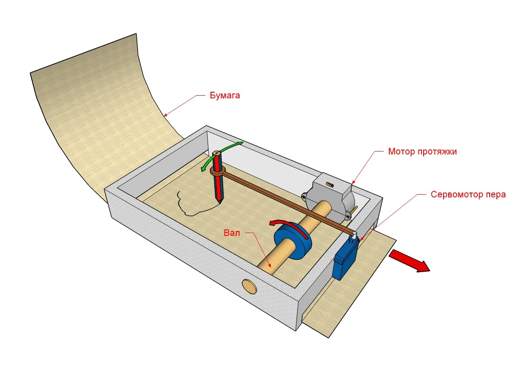

# Привет 👋
Потихоньку вспоминаю и записываю то, что уже реализовано. 
## Что за проэкты здесь появятся:
- На raspberry детектор Северного сияния. Подключенная камера делает равномерные снимки, склеивает из них timelaps, закачивает его автоматически на канал Вконтакте, отправляет на email оповещения о детектировании вспышек полярного сияния - [🌌 Aurora Timelapse](https://github.com/dxqcod/aurora-timelaps)

  

  

  
---

- На связке lora sx1276 и esp8266 дальнобойный модуль управления удаленными устройствами на примере ретронслятора для БПЛА. Сотоит из пульта и блока управления. Насыщен фичами вроде поворотного устройства с направленнвси антенами, переключения картики с камеры на поворотке и бпла, температурными датчики, управления системой охлаждения, отображения на пульте дисплея параметров таких как угол поворота и тд.  [📡 LoRa Station](https://github.com/dxqcod/lora-dx)
  

  

---
  

  
- Самописец в ретро-стиле для измерения концентрации CO₂ в помещении на базе датчика MH-Z19 и контроллера Arduino.  [🌱 Измеритель СО2 ](https://github.com/dxqcod/co2-plotter)
  

  

---
- telegramm бот отправляющий пользователб свежий анекдот. Сделаем визуальные эффекты для тематического обновления страницы

<!--
**dxqcod/dxqcod** is a ✨ _special_ ✨ repository because its `README.md` (this file) appears on your GitHub profile.

Here are some ideas to get you started:

- 🔭 I’m currently working on ...
- 🌱 I’m currently learning ...
- 👯 I’m looking to collaborate on ...
- 🤔 I’m looking for help with ...
- 💬 Ask me about ...
- 📫 How to reach me: ...
- 😄 Pronouns: ...
- ⚡ Fun fact: ...
-->
