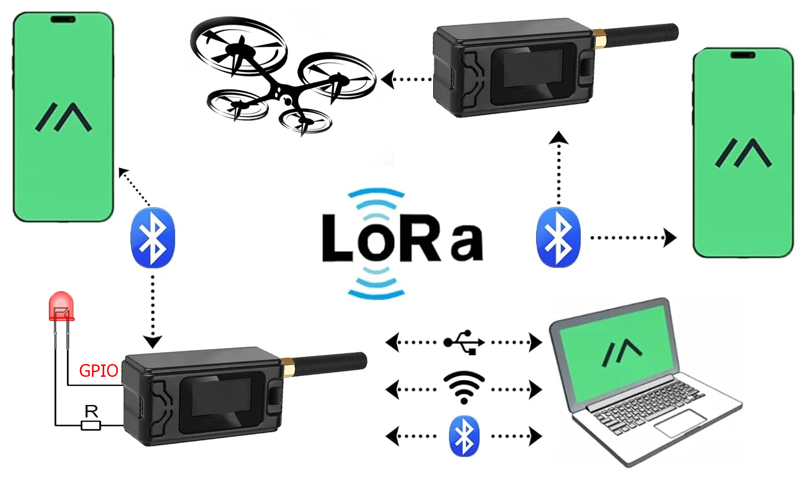

# Привет 👋
Здесь собраны оригинальные идеи, воплощённые в реальных моделях, связанные с  Raspberry, микроконтроллерами esp8266, esp32, Arduino, nRF52840, полётными контроллерами, приемоперелатчиками Lora, ретрансляторы fpv с интересными идеями, интеграции всех устройств с сервисами telegram, vk, meshtastic и др, а также лёгкие идеи в стиле "just for fun". 

## Реализовано:

- Доработка meshtastic для управления внешеними устройствами через GPIO- [meshtastic](https://github.com/dxqcod/meshtastic-gpio)

  

  

  
---

- Детектор Северного сияния. Подключенная камера делает снимки, склеивает из них timelaps, закачивает его автоматически наксервер Вконтакте, отправляет на email оповещения о детектировании вспышек полярного сияния и тд. Реализовано на Raspberry- [🌌 Aurora Timelapse](https://github.com/dxqcod/aurora-timelaps)

  

  

  
---

- На связке lora sx1276 и esp8266 дальнобойный модуль управления удаленными устройствами на примере ретранслятора для БПЛА. Сотоит из пульта и блока управления. Насыщен фичами вроде поворотного устройства с направленнвси антенами, переключения картики с камеры на поворотке и бпла, температурными датчики, управления системой охлаждения, отображения на пульте дисплея параметров таких как угол поворота и тд.  [📡 LoRa Station](https://github.com/dxqcod/lora-dx)
  

  

---
  

  
- Самописец в ретро-стиле для измерения концентрации CO₂ в помещении на базе датчика MH-Z19 и контроллера Arduino.  [🌱 Измеритель СО2 ](https://github.com/dxqcod/co2-plotter)
  

  

---
- Telegramm бот, отправляющий пользователю свежий анекдот. Сделаем визуальные эффекты для тематического обновления страницы  [👻 Ghostbusters ](https://github.com/dxqcod/telegram-jokes-bot)

  

  

---
- Габаритные огни для велосипеда на адресуемых светодиодах  [👻 Happy New Year ](https://github.com/dxqcod/New-Year-s-bike)

  

  
  

  

<!--
**dxqcod/dxqcod** is a ✨ _special_ ✨ repository because its `README.md` (this file) appears on your GitHub profile.

Here are some ideas to get you started:

- 🔭 I’m currently working on ...
- 🌱 I’m currently learning ...
- 👯 I’m looking to collaborate on ...
- 🤔 I’m looking for help with ...
- 💬 Ask me about ...
- 📫 How to reach me: ...
- 😄 Pronouns: ...
- ⚡ Fun fact: ...
-->
